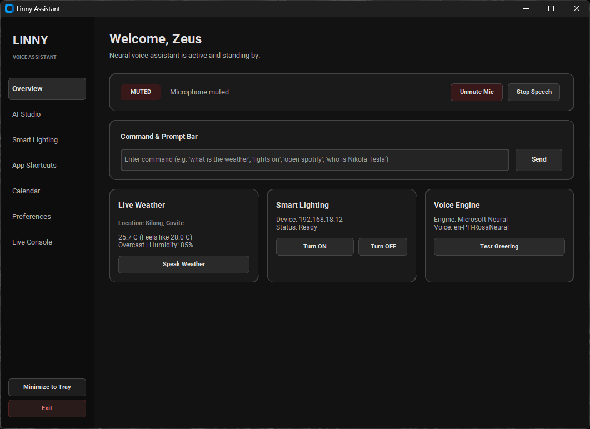
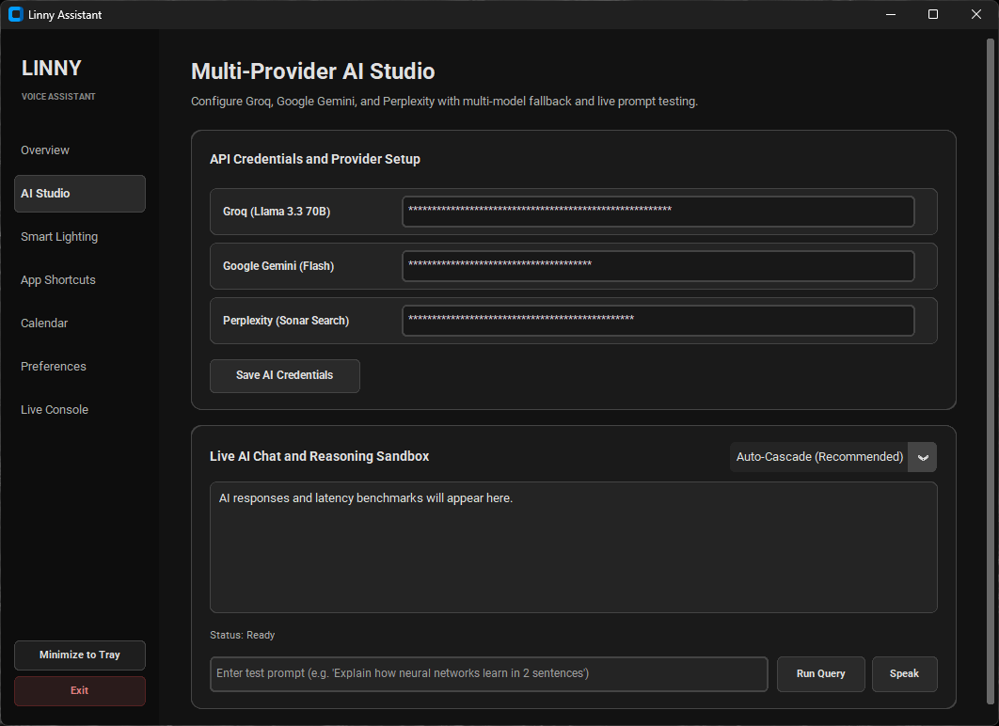
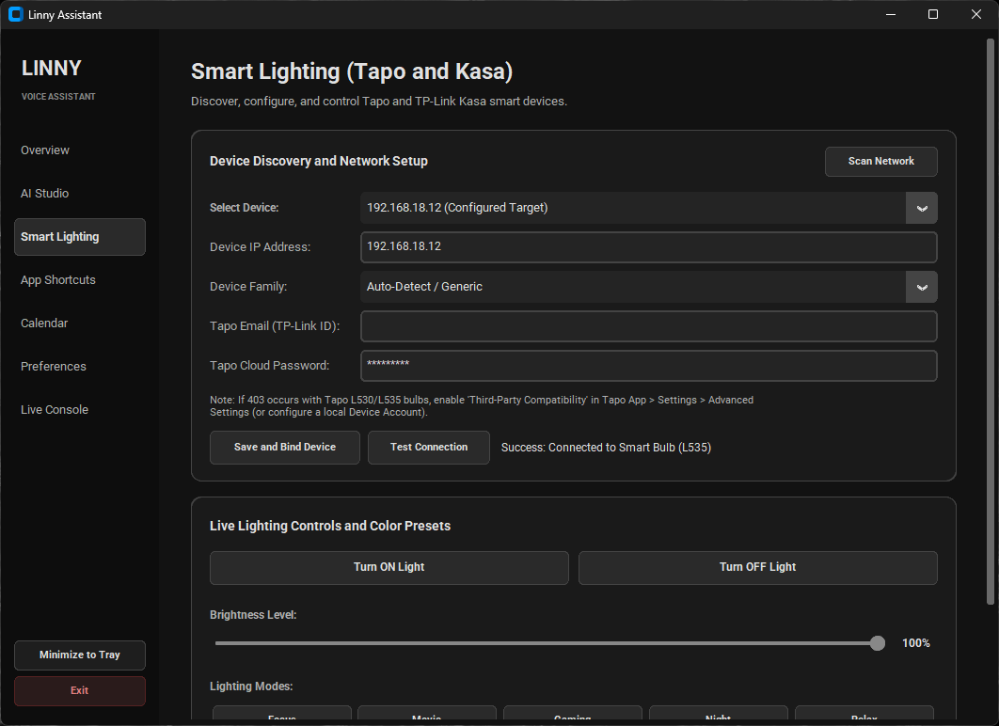
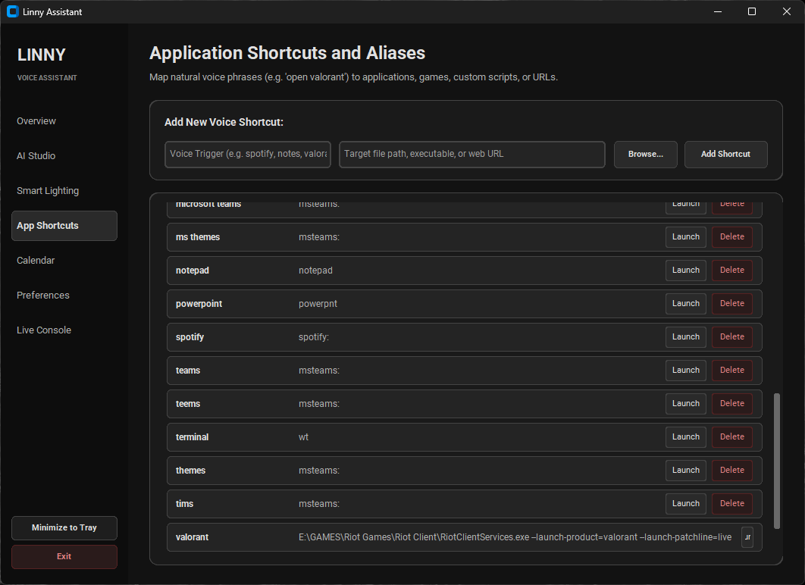
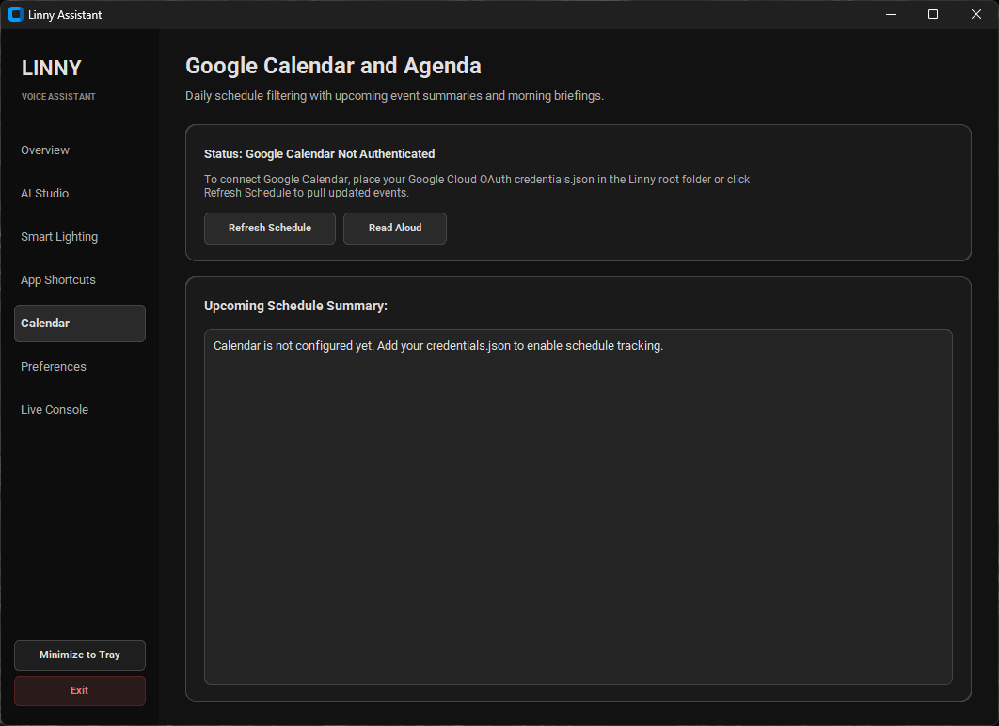
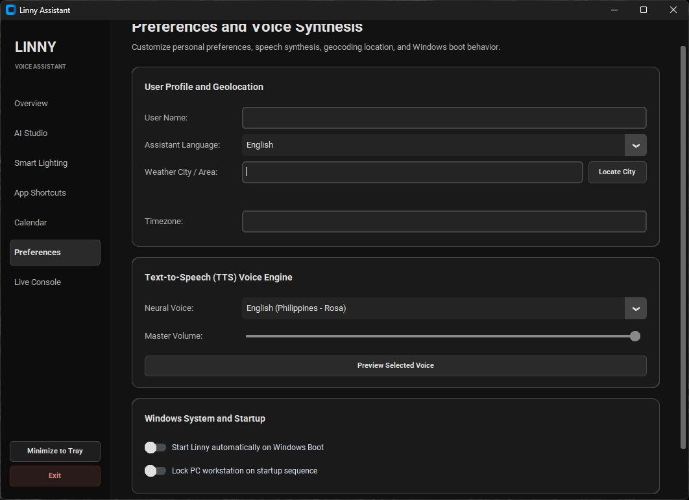
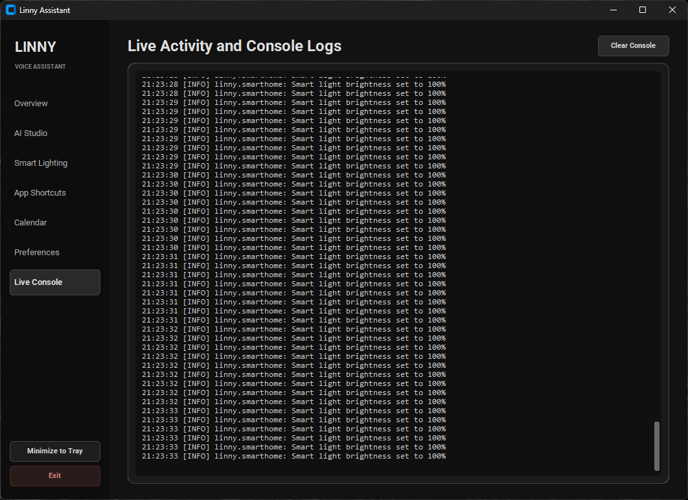

<div align="center">

# L.I.N.N.Y.
### *Loyal Intelligent Neural Network for You*

**Desktop AI Voice Assistant & Smart IoT Automation Suite for Windows**

[-0078D4?style=for-the-badge&logo=windows&logoColor=white)](https://github.com/kidlatpogi/L.I.N.N.Y/releases/latest)
[](https://www.python.org/)
[](https://github.com/TomSchimansky/CustomTkinter)
[](https://github.com/rany2/edge-tts)
[](https://groq.com)
[](https://github.com/python-kasa/python-kasa)
[](LICENSE)

</div>

---

## Executive Summary

**L.I.N.N.Y.** (*Loyal Intelligent Neural Network for You*) is an enterprise-grade desktop voice assistant and ambient computing system built in Python. Designed with a decoupled domain-driven architecture, Linny unifies real-time speech recognition, lifelike neural voice synthesis, multi-model AI reasoning, local smart home IoT automation, Google Calendar scheduling, high-precision weather forecasts, and native Windows OS automation into a minimalist, zero-latency charcoal dark mode interface.

---

## Visual Showcase

| Overview Dashboard | AI Studio Multi-Model Playground |
| :---: | :---: |
|  |  |
| *Reactive dashboard featuring real-time greeting, weather metrics, and instant action triggers.* | *Interactive LLM sandbox with temperature controls and multi-provider failover.* |

| Smart Lighting IoT Controls | Application Shortcuts & Launcher |
| :---: | :---: |
|  |  |
| *Hardware-debounced Tapo/Kasa KLAP controller with real-time diagnostic feedback.* | *Custom executable, URL, and shell alias registry with zero-lag process launching.* |

| Calendar Agenda | Preferences & System Config |
| :---: | :---: |
|  |  |
| *Google Calendar OAuth2 integration with voice agenda summaries.* | *Centralized settings, neural voice picker, and coordinate geocoding.* |

| Live Diagnostic Console |
| :---: |
|  |
| *Thread-safe circular memory logging stream for auditability and troubleshooting.* |

---

## Technical Features

### 1. Intelligent Speech Recognition & Natural Phrase Capture
- **Non-blocking Audio Streaming**: Built on `speech_recognition` with adaptive ambient noise calibration.
- **Natural Voice Parsing**: Configured with extended phrase duration (`phrase_time_limit=12.0s`) and tuned thresholds (`pause_threshold=1.2s`, `non_speaking_duration=0.8s`) to capture multi-word commands without premature cutoff.
- **Direct Intent Routing**: Recognizes both wake-word-prefixed commands (*"Hey Linny open Brave"*, *"Hey open Spotify"*) and direct action commands (*"Weather"*, *"Current time"*, *"Lights on"*, *"Pause music"*).

### 2. Dual-Engine Neural Voice Synthesis (TTS)
- **Primary Engine**: Microsoft Edge Neural TTS (`edge-tts`) using high-definition neural voices (`en-PH-RosaNeural`, `en-US-JennyNeural`, etc.) streamed asynchronously to an in-memory `pygame.mixer` buffer.
- **Local Offline Fallback**: Windows SAPI5 (`pyttsx3`) guarantees vocal feedback even during internet interruptions.
- **Echo Cancellation Lock**: Automatically mutes speech listening during TTS playback to prevent feedback loops.

### 3. Smart Home IoT Automation (Tapo & Kasa)
- **Persistent Asyncio Event Loop**: Kasa and Tapo device operations execute on a dedicated daemon event loop thread (`SmartHomeEventLoop`), eliminating Tkinter GUI thread blocking.
- **Tapo Protocol & Device Account Compatibility**: Full support for Tapo L535E/L530E multicolor bulbs, P100/P110 smart plugs, and legacy Kasa devices over local HTTP Port 80 KLAP.
- **Hardware-Debounced Slider & Request Coalescing**: Features a 200ms UI debounce combined with asynchronous backend request coalescing to prevent hardware overload during rapid slider adjustments.

### 4. Cascading Multi-Provider AI Brain
- **Failover Routing**: Queries cascade seamlessly across **Groq** (`llama-3.3-70b-versatile`), **Google Gemini** (`gemini-2.0-flash`), and **Perplexity AI** (`sonar-pro`).
- **Autonomous Search Intent Detection**: Automatically queries live web data when questions involve real-time events or sports results.
- **Offline Fallback**: Responds with structured local intelligence if network connectivity is unavailable.

### 5. Native Windows Automation & System Power
- **Smart App Launcher**: 3-tier resolver supporting web URLs, direct binaries via `os.startfile`, and complex CLI commands via detached `subprocess.Popen`.
- **Media Controls**: PyAutoGUI-driven multimedia keys for play, pause, track skipping, and volume adjustment.
- **Workstation Security**: High-speed Windows API lock (`ctypes.windll.user32.LockWorkStation`), full-resolution screenshot capture, and GeForce/Xbox Instant Replay clipping.

---

## API Keys Configuration Guide

Linny functions out of the box for system automation, smart lighting, and weather. To enable the conversational AI Brain features, obtain free API keys from any of the following supported providers:

### 1. Groq API Key (Recommended - Ultra Low Latency)
1. Navigate to the [Groq Cloud Console](https://console.groq.com/).
2. Sign in with your Google or GitHub account.
3. In the left sidebar, click **API Keys**.
4. Click **Create API Key**, copy your generated key (`gsk_...`), and paste it into Linny's **Preferences** tab under **Groq API Key**.

### 2. Google Gemini API Key (Free Tier)
1. Visit [Google AI Studio](https://aistudio.google.com/).
2. Sign in with your Google account.
3. Click **Get API key** in the top navigation.
4. Click **Create API key in new project**, copy your key (`AIza...`), and paste it into Linny's **Preferences** tab under **Gemini API Key**.

### 3. Perplexity AI API Key (Web-Grounding)
1. Log in to [Perplexity Settings](https://www.perplexity.ai/settings/api).
2. Generate an API Key under the **API** section.
3. Paste the key into Linny's **Preferences** tab under **Perplexity API Key**.

---

## Supported Voice Commands

| Intent Category | Example Voice Commands | System Action |
| :--- | :--- | :--- |
| **App Launching** | `"Hey open Brave"`, `"Open Spotify"`, `"Launch Discord"`, `"Open VS Code"`, `"Open Valorant"` | Resolves alias or path and launches application cleanly |
| **Weather** | `"What is the weather"`, `"Weather forecast"`, `"Tell me the weather"`, `"Temperature"` | Announces high-precision temperature, conditions, and advice |
| **Time & Date** | `"What time is it"`, `"Current time"`, `"What is the date today"`, `"Time check"` | Announces local time or date in configured timezone |
| **Schedule** | `"What's on my schedule"`, `"Calendar agenda"`, `"What do I have today"` | Synthesizes upcoming Google Calendar appointments |
| **Smart Lights** | `"Turn on the lights"`, `"Lights off"`, `"Set brightness to 50%"`, `"Color blue"`, `"Focus mode"` | Sends non-blocking KLAP commands to Tapo and Kasa devices |
| **Media Playback** | `"Pause music"`, `"Resume"`, `"Next song"`, `"Previous track"`, `"Volume up"`, `"Mute audio"` | Controls Windows media playback keys |
| **YouTube** | `"Play [song/artist] on YouTube"` | Searches YouTube and launches playback in browser |
| **Screen Capture** | `"Take a screenshot"`, `"Clip that"` | Saves full-resolution PNG or triggers GeForce replay clip |
| **Timers** | `"Set a timer for 10 minutes"` | Starts background timer with voice alarm upon completion |
| **System Power** | `"Lock PC"`, `"Shutdown PC"`, `"Restart PC"`, `"Sleep PC"` | Locks workstation, restarts, or shuts down system |
| **AI Brain** | Any conversational question (e.g., *"Who was Ada Lovelace?"*, *"Tell me a joke"*) | Routes query to Groq Llama 3.3, Gemini, or Perplexity |

---

## System Architecture

```
Linny/
├── assets/                     # Portfolio media & screenshots
│   └── screenshots/            # UI captures (Overview, AI, Lighting, etc.)
├── linny/                      # Core application package
│   ├── audio/                  # Audio input & output subsystems
│   │   ├── stt.py              # SpeechListener with adaptive thresholds & echo lock
│   │   └── tts.py              # Asynchronous Edge Neural TTS + SAPI5 fallback
│   ├── core/                   # Domain core & orchestration
│   │   ├── assistant.py        # Master intent router & voice controller
│   │   ├── config.py           # Strongly typed LinnyConfig with atomic JSON persistence
│   │   ├── events.py           # Thread-safe pub/sub EventBus
│   │   └── logger.py           # Structured rotating logger & UI memory buffer
│   ├── integrations/           # External API & hardware adapters
│   │   ├── ai_brain.py         # Cascading LLM client (Groq -> Gemini -> Perplexity)
│   │   ├── calendar.py         # Google Calendar OAuth2 client
│   │   ├── smart_home.py       # Non-blocking Tapo/Kasa KLAP device manager
│   │   └── weather.py          # Open-Meteo weather client with TTL caching
│   ├── system/                 # Windows OS operations
│   │   ├── launcher.py         # Intelligent process, game, and URL launcher
│   │   ├── power.py            # Power states, lock workstation, screenshot & media keys
│   │   └── startup.py          # Windows Registry auto-start & process priority
│   └── ui/                     # Presentation layer
│       ├── app.py              # CustomTkinter master window with 0ms tab switching
│       ├── tray.py             # System tray companion with dynamic state colors
│       └── views/              # Modular charcoal-themed view components
├── scripts/                    # Windows management scripts
│   ├── enable_startup.bat      # Enable auto-start on Windows boot
│   ├── disable_startup.bat     # Remove auto-start from registry
│   └── run_linny.bat           # Quick launcher script
├── linny_config_default.json   # Base configuration template
└── requirements.txt            # Project dependencies
```

## License & Permissions

This project is open-source and licensed under the **MIT License**. See the [LICENSE](LICENSE) file for complete terms.

### Summary of Rights and Obligations

| Category | Provision | Description |
| :--- | :--- | :--- |
| **Permissions** | Commercial Use, Modification, Distribution, Private Use | You are free to run, modify, fork, and distribute this software for personal, educational, or commercial applications. |
| **Conditions** | License & Copyright Notice | The original copyright notice and permission notice must be retained in all copies or substantial portions of the codebase. |
| **Limitations** | No Warranty, Limited Liability | The software is provided "as is" without express or implied warranty. The authors hold no liability for any claims or damages. |